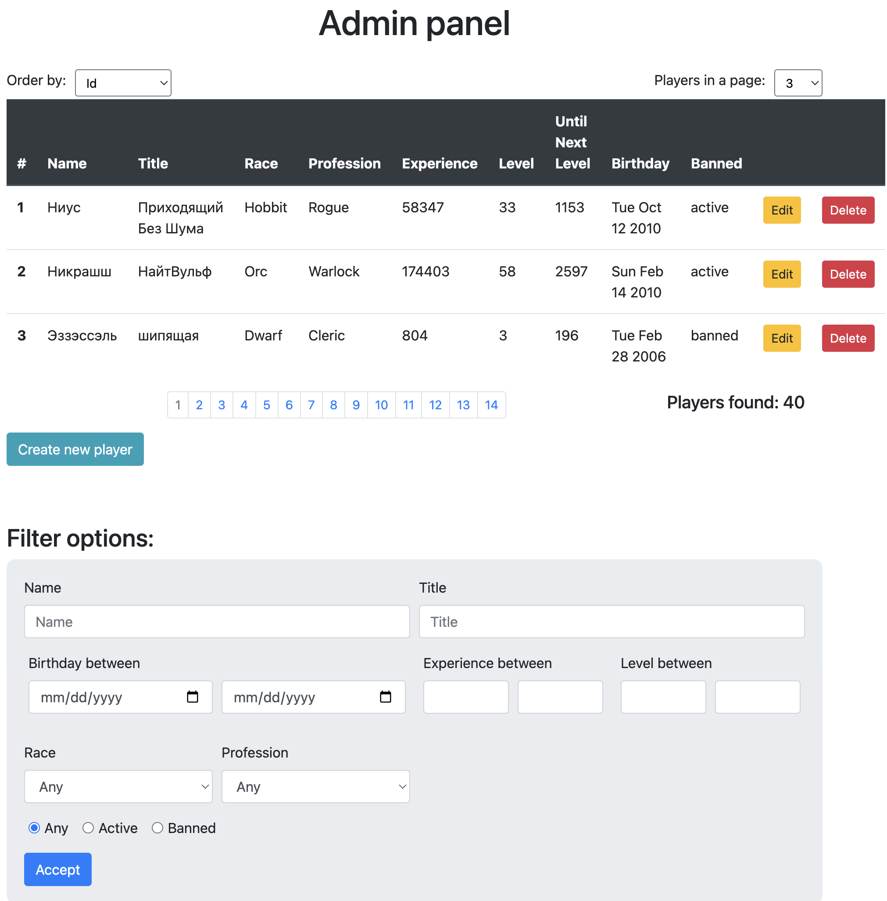

# RPGGameAdminPanel
Приложение для взаимодействия с базой данных игроков. Взаимодействие фронтенда и бекенда по REST API.

*Реализовано:*
Поиск игроков по фильтру с различными параметрами, постраничная навигация по выданным результатам,
создание, удаление, редактирование. Также имееются  end to end тесты контроллера.

*Используемый стек:*
Spring MVC, Spring Data JPA, MySQL, JUnit.
   

    

